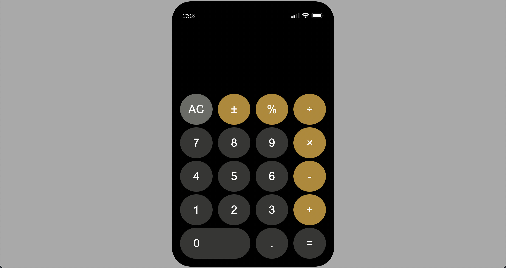

# IOS-Calculator  📱


## Description

IOS calculator code along with HTML, CSS grid structure and Vanilla Javascript structure.
Symbols used in this app: ```± % ÷ × − + =

## Project Skeleton 

```
IOS-calculator (folder)
|
|----readme.md
|----images
|----index.html
|----style.css
|----script.js
``` 

## Expected Outcome




## Extra Challenges

- Make keyboard inputs work with the calculator
- Limit the visible display number to 9 digits
- Make display font size dynamically change for when you have 6, 7, 8, 9 digits

<p align='center'> ⌛ Happy Coding ✍ - Please feel free to check my work out ! 🙃 </p>
